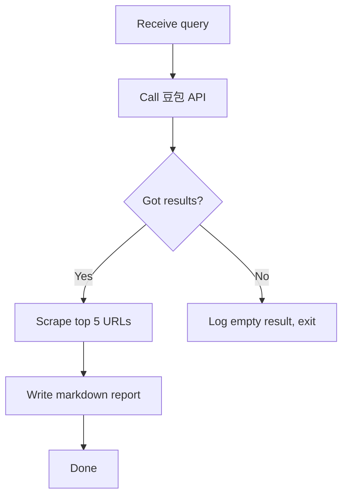

# Agent Building Playbook

> **What this is.** A shared method for building Claude Code agents in our team. Sequenced steps, named artifacts, and the discipline that keeps work reviewable when one person designs and Claude implements.
>
> **Who it's for.** Operators (non-technical), and any teammate who hands work to Claude Code. It assumes you can read code but cannot necessarily write or audit it. Anthropic-authoritative sources are linked at the bottom; everything in this doc is consistent with them but compressed for a beginner workflow.
>
> **What it isn't.** Not a framework you install. Not a runnable codebase. Not a substitute for a senior engineering review on high-stakes systems.

---

## 1. Three commitments

These three rules dictate everything below. If a step in this playbook ever conflicts with one, the rule wins.

### 1.1 Simplicity first

> "Find the simplest solution possible, and only [increase] complexity when needed. This might mean not building agentic systems at all."  — Anthropic, *Building Effective Agents*

Before designing an agent, ask: **does this actually need an LLM in the loop?** A scheduled SQL query that emails a dashboard does not need an agent. A scraper with deterministic parsing does not need an agent. Reach for an agent only when the task requires judgment that cannot be captured in code.

The default answer to "should we add another agent / skill / tool" is **no**. Reverse the default only when you can name a concrete failure of the current setup.

**Workflow vs agent — concrete test.** When you can describe the work, ask:

> "Can I write down every step of the orchestration **without saying 'depends on what the LLM decides'**?"

- **Yes** → it's a *workflow*. LLM is used inside steps (each prompt is an LLM call) but the sequence and transitions are deterministic code. Build as a **CLI script** (`bin/<name>`) — simpler, cheaper, more predictable than a subagent.
- **No** → it's an *agent*. The LLM dynamically decides what to do next based on intermediate results. Build as `.claude/agents/<name>.md`.

Default to workflow. Reach for agent only when judgment-in-loop is genuinely required.

**Naming discipline.** Don't call something "<X> agent" until the test above passes. Casual labels lock in design assumptions — "Research Agent" sounds natural but commits you to subagent overhead before you've checked you need it. Use "<X> workflow" / "<X> pipeline" / "<X> CLI" / just "<X>" for deterministic things; reserve "agent" for confirmed LLM-in-loop work.

Most needs are workflows. Anthropic names five standard workflow patterns (prompt chaining, routing, parallelization, orchestrator-workers, evaluator-optimizer) — see *[Building Effective Agents](https://www.anthropic.com/research/building-effective-agents)*.

### 1.2 Operator-readable artifacts

The operator (the human owning the project) must be able to verify direction without reading code or DSL. That means every design decision lands in **plain-English artifacts** before it lands in code:

- **Intake** — what we're building, in one page of plain English.
- **ADR** (Architecture Decision Record) — why we're building it this way, defendable in a meeting six months later.
- **Rendered diagrams** — pictures the operator can look at, not source the operator must edit.

Code, prompts, DSL files, and configuration are **Claude's responsibility**. The operator does not QA them line-by-line. The contract is: if the operator-readable artifacts are correct, downstream is downstream.

### 1.3 Human gate on irreversibles

Anything Claude does that **cannot be undone** must pass through an explicit human approval gate before firing. Examples:

- Sending email / Slack / SMS
- Writing to a CRM, billing system, or production database
- Posting content to a third-party platform
- Deleting files that aren't sandboxed test artifacts

Reversible work (reading APIs, scraping public pages, writing files inside the repo, drafting content) does not need a gate. The gate is a runtime check, not a design step — but the **list of irreversibles is named in the intake** so we know where the gates need to go.

---

## 2. The three primitives

Every Claude Code agent is built from exactly three building blocks. Pick by asking *"does the inner loop of this work need an LLM call?"*

| Primitive | LLM in inner loop? | Use when | Lives at |
|---|---|---|---|
| **CLI tool** | No | Deterministic work — scrape, parse, query a DB, send a templated email. | `bin/`, `scripts/`, or `src/` (your choice; pick one and stay) |
| **Skill** | Yes (transform only) | Pure LLM transform — rewrite, summarize, classify, extract. No DB or network I/O *inside the skill body*. | `.claude/skills/<name>/SKILL.md` |
| **Subagent** | Yes (orchestrating) | LLM that drives a workflow — invokes skills, calls CLIs, decides next step. | `.claude/agents/<name>.md` |

**Why this split matters.** CLIs are testable in isolation (run them, inspect output). Skills are auditable as markdown (read them, no execution needed). Subagents have explicit, scoped tool access (you can see what they're allowed to touch). Mixing roles — e.g., a skill that also writes to the database — collapses these guarantees.

**Reference**: [Claude Code Subagents](https://code.claude.com/docs/en/sub-agents) · [Claude Code Skills](https://code.claude.com/docs/en/skills)

---

## 3. The 4-step design recipe

For every new agent, feature, or non-trivial skill, follow these four steps **in order**, before any code is written.

### Step 1 — Napkin flow

**One sentence describing what the thing does.** If it doesn't fit in a sentence, the thing is too big. Split it.

> ✅ "Given a search query, the research agent returns a markdown report of competitor citations and their source URLs."
>
> ❌ "The research agent ingests queries, scrapes competitors, evaluates rankings, drafts content plans, and hands off to the generator." (Five things. Five napkins.)

**Test**: can this thing run in isolation and produce a useful artifact? If the napkin flow only makes sense when chained to a downstream agent, you've described a pipeline, not a single agent.

### Step 2 — Tools list (with irreversibles flagged)

List every external action this thing can take. Mark each one **(R)** for reversible or **(!)** for irreversible.

```
- (R) Read DB: leads.db
- (R) Read API: 豆包 query endpoint
- (R) Scrape: cited URLs
- (R) Write file: docs/research/<query>.md
- (!) Send email: notify operator on failure
- (!) Post to 头条: publish approved draft
```

The (!) lines are where human gates go. If you're unsure whether something is reversible, treat it as irreversible.

### Step 3 — Happy path vs failure paths

For each step in the workflow, write **one happy outcome and at least two failure modes**. Most beginners design for the happy path only; agents fail on the second column.

```
Step 1: Read trending queries from Baidu SEM
  ✓ Happy: returns 50 queries, sorted by volume
  ✗ Failure A: API rate-limited → wait 60s, retry once, then exit
  ✗ Failure B: zero queries returned → log "no demand signal", skip cycle

Step 2: Scrape top 5 cited URLs per query
  ✓ Happy: HTML retrieved for all 5
  ✗ Failure A: 403 / robots.txt block → skip URL, log, continue
  ✗ Failure B: page renders client-side, scraper sees empty body → flag for manual review
```

This exercise is the **single highest-leverage thing a non-technical operator can do**. Operational edge cases are exactly what you can see and engineers often miss.

### Step 4 — ADR (Architecture Decision Record)

A short markdown file that records *why we chose this design over alternatives*. Format: [MADR](https://adr.github.io/madr/). Three sections matter:

```markdown
## Decision
<one paragraph: what we're doing>

## Rationale
<why this over alternative A, alternative B>

## Consequences
<what we accept by choosing this — costs, limitations, future migration cost>
```

**The ADR is the operator's deliverable.** It's the thing you can defend in a meeting six months later when someone asks "why is the research agent stateless instead of caching?" The intake captures *intent*; the ADR captures *judgment*.

Claude drafts the ADR. The operator approves it. After approval, Claude updates the structural model (LikeC4) and writes code.

---

## 4. Documentation map

| Artifact | Author | Purpose | Lives at |
|---|---|---|---|
| **Intake** | Operator (plain English) | Captures what & why before any technical layer. One per feature. | `docs/intake/000N-<name>.md` |
| **ADR** | Claude drafts; operator approves | Decision rationale. One per decision. | `docs/adr/000N-<title>.md` |
| **LikeC4 model** | Claude maintains; operator reads rendered output | Whole-system structural canon — auto-loaded into every Claude session. | `docs/architecture/likec4/model.c4` |
| **How-to runbook** | Either | Operator recipes for recovery / re-runs. | `docs/how-to/<name>.md` |
| **External API reference** | Either | Pinned third-party API behavior. Dated. | `docs/references/<api>.md` |
| **Subagent prompt** | Claude | Runtime — how the agent behaves when invoked. | `.claude/agents/<name>.md` |
| **Skill** | Claude | Runtime — how a specific transform is performed. | `.claude/skills/<name>/SKILL.md` |
| **CLI tool** | Claude | Runtime — deterministic scripts. | `bin/`, `scripts/`, or `src/` |
| **CLI tools index** | Claude | Mirror of every CLI's purpose + side-effect class. Quick scan; not authoritative. | `docs/cli-tools.md` |

**CLI side-effect classes.** Every CLI in the index is one of:

- `local` — DB writes or read-only network. No third-party state changes.
- `external` — irreversible write to a real third party (mailbox, CRM, customer-facing sheet, paid ad, posted content).

The `external` class is the operational "needs human gate" signal. Mirror it in three places:

1. The CLI's own behavior (`external` commands should not auto-fire — require an explicit flag or pre-existing approval row).
2. The agent's `side_effects:` frontmatter.
3. The LikeC4 `#side-effect-external` tag on the relationship to the external system.

The index is a quick scan; the **canon is the LikeC4 tag + frontmatter**. If they disagree, fix the index.

**Authority order** when sources disagree: see `docs/AUTHORITY-ORDER.md` in your project. The general rule: *runtime* (`.claude/`, `src/`) > *structure* (LikeC4) > *decision* (ADR) > *runbook* (how-to) > *external reference*.

**Intake and cli-tools.md are not in the authority order.** Intakes are historical once built (write a new ADR if design changes). The cli-tools.md index mirrors LikeC4 + frontmatter, which are canonical. If they disagree, fix the index — never the other way around.

---

## 5. The diagram strategy

Diagrams are useful for two things: (a) Claude reads them to stay consistent, (b) the operator shows them to teammates without writing prose. Use the right type for each job.

### 5.1 Structural diagrams — LikeC4

**Use for**: "What components exist? What connects to what? What are the boundaries?"

- One file: `docs/architecture/likec4/model.c4` (plus `views.c4` and `specification.c4`).
- **Whole-system scope**, not per-feature. There is exactly one model.c4 per project.
- Auto-loaded into every Claude session via `@imports` in CLAUDE.md.
- **Claude maintains the DSL.** The operator looks at the rendered SVG, not the source.

**Daily commands** (Node 20+):

| Command | Use |
|---|---|
| `npx likec4 dev` | Local web preview, hot-reloads as you edit. The operator's primary way to look at the model. |
| `npx likec4 validate` | Syntax + layout drift. Run before every commit; treat errors as blockers. |
| `npx likec4 export png -o ./assets` | Export views as PNG for sharing in PRs / docs. |
| `npx likec4 export drawio` | Reverse export to draw.io (rare — only if you're going back to brainstorm). |

**Editor**: install the official **LikeC4 VSCode extension** for inline preview, validation, jump-to-definition, and safe rename. Full CLI reference: <https://likec4.dev/tooling/cli/>.

**Project script convention.** Every project with LikeC4 should expose these npm scripts so the daily commands are short, discoverable (`npm run`), and identical across projects:

```json
{
  "scripts": {
    "arch:preview": "likec4 dev",
    "arch:validate": "likec4 validate",
    "arch:export-png": "likec4 export png -o docs/architecture/likec4/exports"
  },
  "devDependencies": { "likec4": "^1" }
}
```

After `npm install`, daily use is `npm run arch:preview` / `npm run arch:validate`. CI runs `npm run arch:validate` as a blocker.

**Element-kind conventions.** The template's `specification.c4` declares these kinds; use them consistently across projects:

| Kind | Shape | Use for |
|---|---|---|
| `actor` | person (dark blue) | Humans outside the system — operators, support teams |
| `agent` | person (sky blue) | LLM-driven worker inside the system — has judgment, scoped tools |
| `component` | rectangle | Deterministic process — no LLM call in the inner loop |
| `skill` | browser | Pure transform — never has side effects |
| `gate` | rectangle (amber) | Fail-closed check — pair with a `blocked` terminal for the failed branch |
| `datastore` | cylinder | Pipeline DB — actors do not connect directly; route through a CLI or component |
| `externalSystem` | rectangle (muted) | Anything outside the system boundary |

The `actor`/`agent` split is intentional. Both render as person because both have judgment. `actor` is *outside* the system boundary (a real human) and `agent` is *inside* (something we built). The visual similarity captures the conceptual one; spatial position in the diagram tells you which is which.

Layout direction (`autoLayout TopBottom` vs `LeftRight` etc.) is per-diagram aesthetics, not a project convention. Pick whichever reads better for that specific view; revisit when the model changes shape.

### 5.2 Workflow diagrams — Mermaid in markdown

**Use for**: "How does this specific agent step through its work? Where does it branch?"

- Embedded directly in the intake file (section 3, "Happy path vs failure paths").
- Mermaid renders natively on GitHub and in VS Code's markdown preview — no extra tooling.
- One per intake. Read on-demand when working on that feature.
- Short. If the flowchart needs more than ~20 nodes, the agent is doing too much — go back to step 1 (napkin) and split.

Example block (paste directly into an intake):

````markdown

````

### 5.3 Brainstorming sketches — whatever's fastest

**Use for**: "I'm working out an idea before I'm ready to commit to it."

- draw.io, paper, whiteboard photo, iPad, napkin. Whatever lets you think.
- **Throwaway.** Brainstorming sketches must never end up in the repo's canonical doc tree (`docs/`). They're not maintained and they will rot.

**The `scratch/` convention.** Every project should have a top-level `scratch/` directory, **gitignored**. This is where rough sketches, screenshots, and half-baked notes live while they're still in flux.

```
my-project/
├── scratch/               ← gitignored. drawio, png, .md drafts.
├── docs/                  ← canonical. intake / adr / likec4 / playbook.
└── ...
```

Why a project-local folder rather than "anywhere on your disk":

- Claude Code can read files in `scratch/` when you reference them (e.g., `@scratch/idea.png`).
- It's right next to the project, not lost in `~/Downloads/`.
- The gitignore guarantee means you can't accidentally commit a half-thought.

**Workflow** (the human-Claude round trip):

1. Sketch on whatever feels fastest. Drop the file (or screenshot) into `scratch/`.
2. Hand the path to Claude with explicit destination instructions:
   > *"Look at `scratch/research-flow.png`. Update `docs/intake/0001-research-agent.md` section 3 with a Mermaid version. If this changes the structural model, update `docs/architecture/likec4/model.c4`. Tell me which files changed."*
3. Claude translates the sketch into Mermaid (in the intake) and/or LikeC4 (in `model.c4`).
4. Operator reviews the rendered output (markdown preview, `npm run arch:preview`), not the source.
5. Once the idea has a real intake, **the scratch sketch is no longer canonical** — delete it from `scratch/` or leave it as historical noise. Don't try to keep it in sync with the intake.

### 5.4 What we don't draw

- **Per-agent C4 diagrams** — the system-level model.c4 already covers it. Don't add C3/C4 (component / code) levels for a single project.
- **State-machine diagrams** — only when the agent has multiple distinct *waiting* states (e.g., waiting for human approval AND waiting for an async webhook). A linear flow is just the Mermaid flowchart.
- **Swim-lane diagrams** — only when 2+ actors hand off (multiple agents OR agent + multiple humans). For "agent does work → operator approves," the napkin sentence covers it.

**Rule of thumb**: if a diagram type doesn't change what we tell Claude, we don't draw it.

---

## 6. Working with Claude Code

### 6.1 Intake-first

The first file you touch for any new agent or feature is `docs/intake/`. Not the LikeC4 model. Not the agent prompt. Not code. The intake.

If a teammate asks Claude for a new feature without an intake, Claude's first response should be **"let's fill in `docs/intake/<name>.md` first"**, not code. Bug fixes, doc edits, and small chores skip the intake.

### 6.2 Build one thing at a time

Even if the project will eventually have three subagents (planner, generator, evaluator), build one end-to-end before starting the next.

- Write intake 0001 → ADR → LikeC4 update → code → ship → use it once
- *Then* write intake 0002

Building all three in parallel feels efficient and produces three half-built agents that don't compose. Building one at a time produces one working agent and clearer requirements for the next.

### 6.3 Test in isolation

Each primitive should be invokable on its own:

- A **CLI tool** runs from a shell with documented arguments
- A **skill** can be triggered via `/skill-name` and produces output independently
- A **subagent** can be invoked with a test input and you can read its output

If a piece can only be tested as part of the full pipeline, you've built coupling that will hurt debugging later.

### 6.4 The whiteboard → docs round trip

The standard way to bring an idea into the repo:

1. **Sketch** the idea however is fastest (draw.io, paper, etc.)
2. **Hand off** to Claude with explicit destination instructions:
   > "Update intake 0001 with this workflow as Mermaid. If the structure changes, update model.c4. Tell me what changed."
3. **Review** the rendered Markdown / LikeC4 output (not the source)
4. **Iterate** — push back, refine, until the rendered version matches your mental model
5. **Discard** the sketch — the repo artifacts are now canonical

---

## 7. Update cadence

When and what to update, by artifact:

| Artifact | Update when | Don't update when |
|---|---|---|
| **CLAUDE.md** | A new pattern is established (e.g., first agent's frontmatter shape); a non-obvious gotcha trips Claude repeatedly; new top-level invariant. | You finished an agent (that goes in `.claude/agents/<name>.md`); refactored visible code; "for completeness." |
| **model.c4** | Adding a component, changing a boundary, adding/removing an external system or relationship. **Same commit as the behavior change.** | A skill's internal phrasing changed; a refactor with no structural impact. |
| **Intake** | **Almost never.** Once approved + built, treat as historical. If design needs change, write a new ADR. | After the build, to "match reality" — that creates a false history. |
| **ADR** | New decision; a previous decision is superseded (mark old one Superseded, write new one). | To clean up phrasing — ADRs are append-only history. |
| **PLAYBOOK.md** (this file) | A team retro reveals a missing step; a recurring mistake reveals an unwritten rule. | Theory time — only update from real friction, not anticipation. |

**60-second rule for CLAUDE.md.** After each shipped agent, take 60 seconds to scan CLAUDE.md. 80% of the time, no change. The 20% — usually a new invariant the build revealed — gets added and committed alongside the agent.

---

## 8. Common anti-patterns

These are the failure modes we've seen and want to prevent.

| Anti-pattern | What it looks like | Fix |
|---|---|---|
| **Mega-intake** | One intake covers 3 agents. Napkin flow is 4 sentences. | Split. One intake per agent. |
| **Pipeline-only napkin** | "Research agent: gives data to generator." Doesn't run in isolation. | Rewrite to describe what the agent *outputs*, not who consumes it. |
| **Skipping irreversibles** | Tools list has only (R) marks because "we're not sending emails yet." | Mark *future* irreversibles too. The gate design happens before the irreversible action exists. |
| **Happy-path-only design** | Section 3 has 5 steps, each with one bullet. | For each step, write at least 2 failure modes. If you can't think of any, you haven't thought hard enough. |
| **Drawing C3/C4 levels** | Creating `model-research-agent.c4`, `model-generator.c4`, etc. | One model.c4 per project. Add views to the existing model, not new files. |
| **Per-feature LikeC4** | Putting `model.c4` inside `docs/intake/<feature>/`. | model.c4 is system-scope. It lives once at `docs/architecture/likec4/`. |
| **Editing intake after build** | "Updating the original intake to match what we shipped." | Forbidden. Write a new ADR for the change. The intake is historical. |
| **Stale diagrams** | LikeC4 says component X exists; code shipped without it. | Treat diagram updates as part of the same commit. Stale diagram > no diagram in badness. |
| **Tool shopping** | "Should we use draw.io, LikeC4, or Mermaid?" asked again every project. | The answer is in this playbook (LikeC4 + Mermaid). Stop re-deciding. |
| **Mock-driven tests** | Integration tests use mocks because real deps are inconvenient. | Hit real services (in a sandbox) for the layers where mock/prod divergence would mask real bugs. |

---

## 9. References

Authoritative sources this playbook is built on. When this doc and an Anthropic source disagree, the Anthropic source wins — file an issue against this playbook.

- **[Building Effective Agents](https://www.anthropic.com/research/building-effective-agents)** — Anthropic, the foundational pattern paper. Read sections "When (and when not) to use agents" and "Building blocks, workflows, and agents."
- **[Building Effective AI Agents — Architecture Patterns PDF](https://resources.anthropic.com/hubfs/Building%20Effective%20AI%20Agents-%20Architecture%20Patterns%20and%20Implementation%20Frameworks.pdf)** — extended version with implementation patterns.
- **[Equipping agents for the real world with Agent Skills](https://www.anthropic.com/engineering/equipping-agents-for-the-real-world-with-agent-skills)** — Anthropic engineering, the recommended evaluation-driven approach to building skills.
- **[Claude Code Subagents](https://code.claude.com/docs/en/sub-agents)** — official, authoritative on file location, frontmatter, and tool scoping.
- **[Claude Code Skills](https://code.claude.com/docs/en/skills)** — official, full SKILL.md frontmatter reference and skill lifecycle.
- **[Introduction to Agent Skills (Anthropic Skilljar course)](https://anthropic.skilljar.com/introduction-to-agent-skills)** — beginner-paced walkthrough.
- **[MADR — Markdown Architecture Decision Records](https://adr.github.io/madr/)** — the ADR format we use.
- **[LikeC4](https://likec4.dev/)** — the structural diagram tool (`likec4 validate`, `likec4 dev`).

---

## 10. Glossary

| Term | Means |
|---|---|
| **Agent** | An LLM-driven workflow that decides what to do next based on intermediate results. Has a scoped toolbelt and runs in its own context window. |
| **Skill** | A markdown file with instructions Claude uses for a specific task. No I/O inside the skill body. |
| **CLI tool** | A deterministic script (bash, Python, TypeScript). No LLM call in the inner loop. |
| **Subagent** | A specialized agent invoked by the main Claude session, with its own system prompt and tools. |
| **Intake** | A plain-English document describing what we want to build, before any technical work. |
| **ADR** | Architecture Decision Record — markdown file recording why a design choice was made. |
| **LikeC4** | A typed DSL for C4-model architecture diagrams; auto-loaded into every Claude session. |
| **C4 model** | A 4-level architecture description: Context (C1), Container (C2), Component (C3), Code (C4). We use C1 + C2 only. |
| **Irreversible action** | An external write that cannot be undone (sent email, posted content, money moved). Requires a human gate. |
| **Frontmatter** | The YAML block at the top of a `.md` file between `---` markers. Used by Claude Code to configure skills and subagents. |
| **MADR** | Markdown Any Decision Records — a lightweight ADR format. |
| **Authority order** | When two docs disagree, which one wins. See `docs/AUTHORITY-ORDER.md` in the project. |

---

*This playbook is a living document. If a step here doesn't match how the team actually works, the playbook is wrong — open a PR.*
